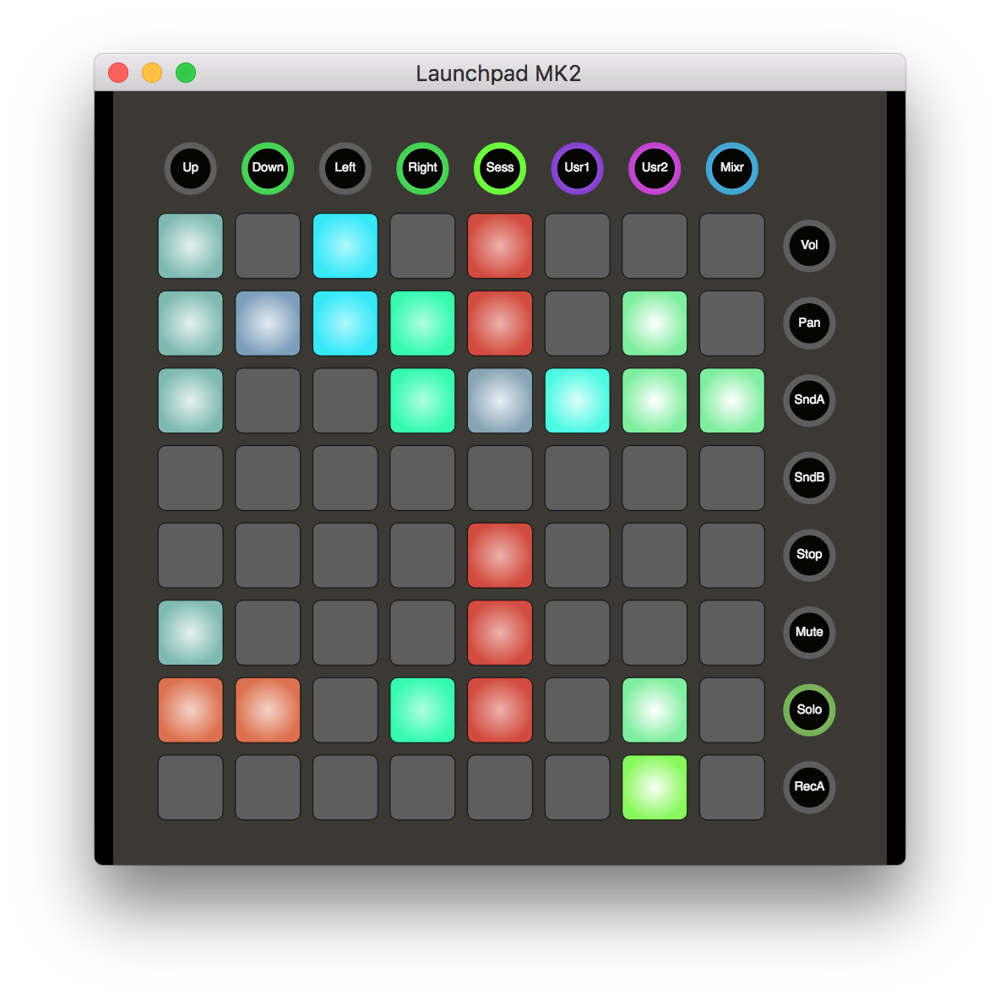
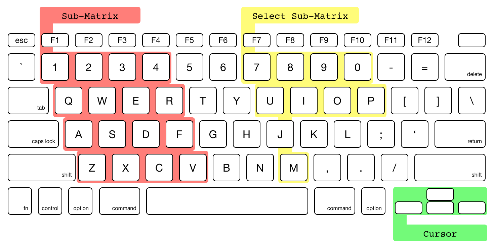

# Virtual MIDI Matrix Pad

Electron-based Virtual MIDI Controller that like [Novation Launchpad](https://us.novationmusic.com/launch/launchpad)



## Installation
Use Node v10.\*, Python 2.7.\*, and Visual Studio 2017 to build this project. Recent versions are not supported by some modules in this project.

```
$ git clone https://github.com/mohayonao/virtual-midi-matrix-pad.git
$ cd virtual-midi-matrix-pad
$ npm install
```

## Run

```
$ npm start
```

### ...with Web Based App

If set the environment variable `PORT`, you can use the web based app. In the web based app with a tablet, you would get the UX that is closer to a hardware MIDI device.

```
$ PORT=7700 npm start
```

## Keyboard Layout



## Build (for macOS)

```
$ npm run package
```

## License

MIT
